## 项目背景
起初打算做一个角色扮演的小说生成器，先是简单的使用 ** OpenRouter ** 模型 + System Prompt 形式做的。

后续想加个文生图功能，而在流式响应中没法支持文生图功能，遂做了两个工具：意图识别 + 生图，但是意图识别是只给 LLM 思考了一次，没法很准确识别，以及最开始实现的是 Function Calling 的形式。

最后决定重构成 MCP -- Agent -(ReAct)- LLM 架构，然而已经偏离了最初的小说生成器了，已经变成一个 AI 角色扮演聊天工具了，后续再考虑将一些小说的场景做成 System Prompt 以及后续增加对应模型实现了，现在用的 Qwen 模型没有经过对应训练，生成出来的笔风有点一般的。

## 主要技术

- [langchain](https://js.langchain.com/docs/introduction/) 封装好的一些 AI 交互逻辑，方便做记忆功能，不用再手写做没必要功夫
- [mcp](https://modelcontextprotocol.io/docs/getting-started/intro) 标准的 MCP 协议封装

主要是这些，像里面用到的 Huggingface，OpenRouter，Supabase 这些不太重要，都是一些模型提供的接口以及数据库罢了，我只记录下我开发 Agent 的一些心得以及遇到的一些坑。

### MCP
先写一下 ** Mcp ** 吧，他的全称就是 Model Context Protocol(大模型上下文协议)，概念没啥好讲的，就是一个为了统一告诉大模型有哪些工具你可以使用这些工具来获取对应的信息，最后总结答案。

MCP 组成就有三个东西：MCP Server，MCP Client, MCP HOST
- **MCP Server**: 一些工具的集合服务器

- **MCP Client**: 与 MCP Server 进行交互的客户端，这里我问过 Gemini 为什么要与MCP Server 进行一个一对一连接，它跟我说是为了单一职责以及增强的安全与控制；从 Cursor 的使用上来看，好像也是一个 Client 对应一个 Server(这里来源群友分享 Agent 的知识会议)，在我编写的过程中也感觉到了单一连接的好处，可以避免一些调用不同 Server 的工具问题，如果是接入多个 Server 且他们有同名的工具时候可能会有冲突，当然这个情况我还没遇到，因为我只有两个 Tools

- **MCP HOST**: 用于管理 MCP Client 的主机，如 Cursor，Cline 这些，他们可以添加一些 MCP Server 的，然后他们内部做的 Clinet 来连接

目前 Client 和 Server 的连接方式按照官网写的有两种，一是标准的输入输出，二是 HTTP 与 SSE, 在这个项目中我用的是 HTTP 形式，为什么不用标准的输入输出呢，因为在群友分享的 Agent 的知识会议中说这种方式我们在写 `console.log` 这些输出日志信息会影响到 Client 和 Server 的交互。

### Client 与 Server 交互流程

Client 发起初始化请求，Server 接收到后会创建一个 Session Id
```json
{
  "method": "initialize",
  "params": {
    "protocolVersion": "2025-06-18",
    "capabilities": {},
    "clientInfo": {
      "name": "generate_image",
      "version": "1.0.0"
    }
  },
  "jsonrpc": "2.0",
  "id": 0
}
```

Client 收到这个 Session Id 后会再次发送请求，告诉 Server 初始化完成
```json
{
  "method": "notifications/initialized",
  "jsonrpc": "2.0"
}
```

Client 通过 Server 的 Url 地址来进行连接
```ts
const transport = new StreamableHTTPClientTransport(
  new URL(url),
)
await this.client?.connect(transport as any)
```

这时候 Client 就可以通过 getAllTools 来获取 Server 下注册的所有工具集，然后进一步给 Agent 转成 System Prompt 告诉 LLM 当前有什么工具可用

### Agent
一个 MCP 与 LLM 中间的操作手，负责与 LLM 对话以及调用工具，下面就是我项目 Agent 的工作流

```mermaid
graph TD
  User[👤 用户输入] --> Agent[🤖 Agent]

  Agent --> GetTools[获取工具列表]
  GetTools --> MCP[🔧 MCP Manager]
  MCP --> GetTools
  GetTools --> ReActLoop[ReAct 循环开始]

  subgraph "ReAct 循环 (最多8轮)"
    ReActLoop --> Thought[🧠 Thought<br/>思考分析问题]
    Thought --> LLM[🤖 LLM<br/>生成响应]
    LLM --> Parse[📝 解析响应]

    Parse --> CheckComplete{是否有<br/>final_answer?}
    CheckComplete -->|是| FinalAnswer[✅ 返回最终答案]

    CheckComplete -->|否| CheckAction{是否有<br/>action?}
    CheckAction -->|是| Action[⚡ Action<br/>执行工具调用]
    CheckAction -->|否| Error[❌ 格式错误]

    Action --> CallTool[调用 MCP 工具]
    CallTool --> MCP
    MCP --> Observation[👁️ Observation<br/>获取工具结果]
    Observation --> AddToHistory[添加到对话历史]
    AddToHistory --> Thought
  end

  FinalAnswer --> Response[📤 返回给用户]
  Error --> Response

  style Thought fill:#e1f5fe
  style Action fill:#f3e5f5
  style Observation fill:#e8f5e8
  style FinalAnswer fill:#fff3e0
```

